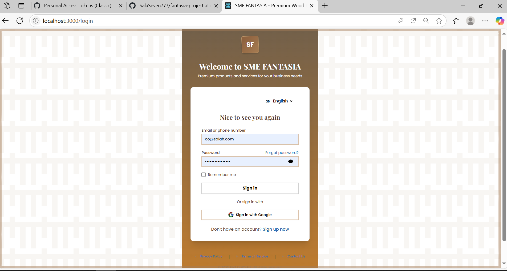
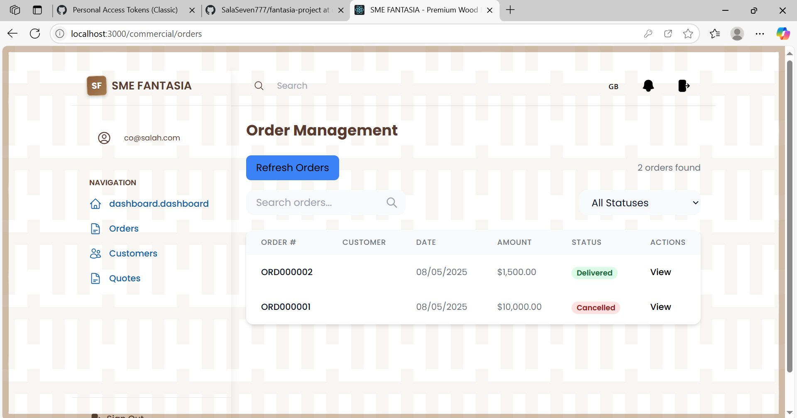
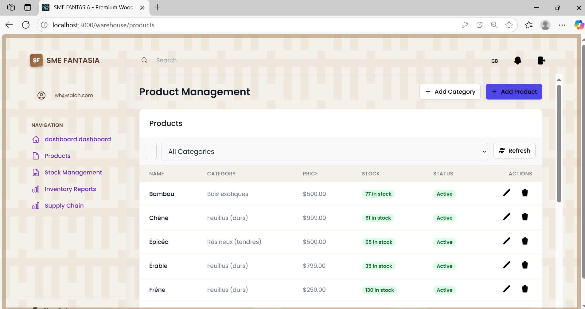
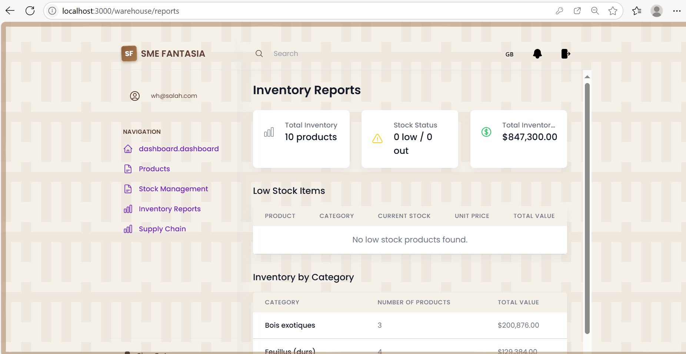
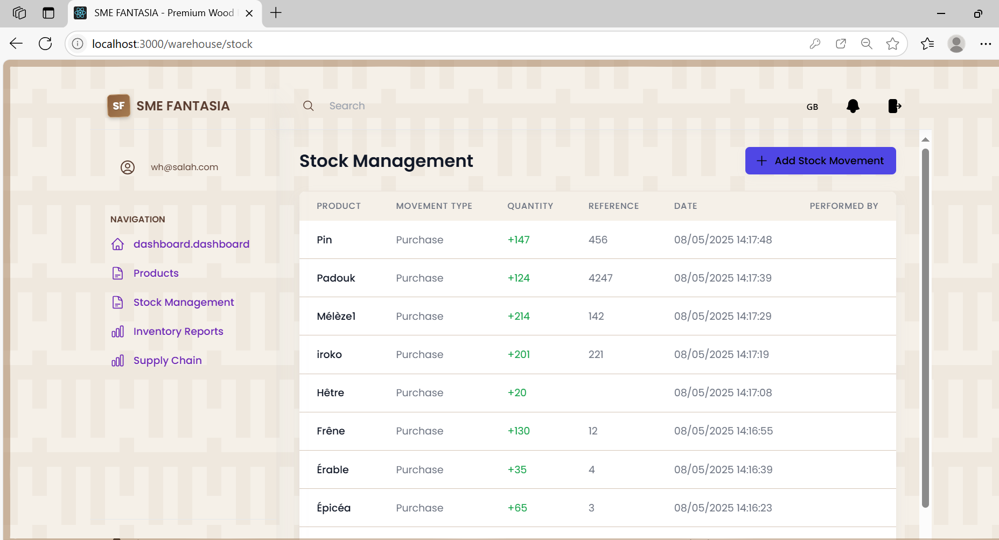
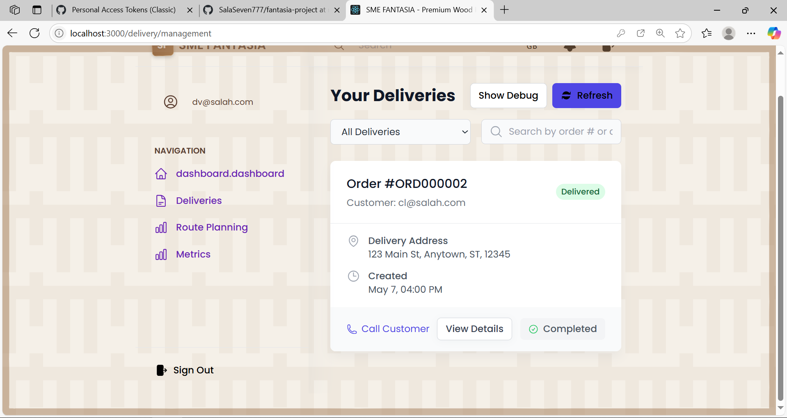
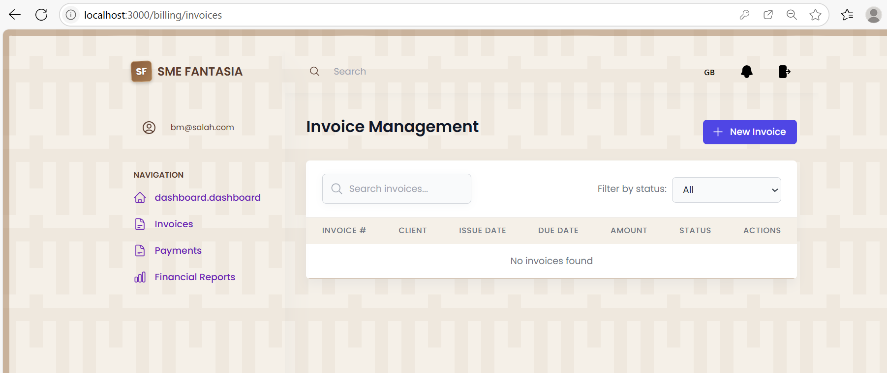

# LATTÉ BOIS E-Commerce Management System

A full-stack e-commerce management system for LATTÉ BOIS, a laminated wood panel manufacturer.

## Project Structure

```
django-react-project/
├── backend/                 # Django backend
│   ├── config/              # Django project settings
│   ├── orders/              # Orders management app
│   ├── products/            # Products management app
│   ├── users/               # User management app
│   ├── commercial/          # Commercial operations app
│   ├── billing/             # Billing and invoicing app
│   ├── inventory/           # Inventory management app
│   ├── media/               # User uploaded files
│   ├── requirements.txt     # Python dependencies
│   └── manage.py            # Django management script
├── frontend/                # React frontend
│   ├── src/                 # React source code
│   ├── public/              # Static files
│   ├── package.json         # Node.js dependencies
│   ├── tailwind.config.js   # Tailwind CSS configuration
│   ├── tsconfig.json        # TypeScript configuration
│   └── postcss.config.js    # PostCSS configuration
└── .gitignore               # Git ignore file
```

## Technology Stack

- **Frontend**: 
  - React with TypeScript
  - Tailwind CSS for styling
  - React Router for navigation
  - React Bootstrap for UI components
  - React Error Boundary for error handling
  - Heroicons for icons

- **Backend**: 
  - Django (Python)
  - Django REST Framework for API
  - PostgreSQL database

- **Authentication**: 
  - JWT (JSON Web Tokens)

## Features

- Role-based access control (8 different user roles)
- Admin dashboard
- Client shop
- Product management system
- Order processing and tracking
- Inventory management
- Delivery management
- Billing and invoicing

## Project Preview

### Authentication



### Admin Interface

Various admin interfaces for system management and monitoring:


### Client Interface

Client-facing e-commerce interface for browsing and purchasing wood products.


### Commercial Module

Tools for the sales team to manage clients, quotes, and orders.




### Warehouse Management

Inventory and stock management interface for warehouse managers.






### Delivery Management

Logistics and delivery tracking system for managing product shipments.




### Billing and Invoicing

Financial tools for invoice generation, payment tracking, and reporting.




## Prerequisites

- Python 3.8+
- Node.js 20.0+
- PostgreSQL
- Git

## Installation

### Clone the repository

```bash
git clone https://github.com/your-username/django-react-project.git
cd django-react-project
```

### Set up the backend

```bash
cd backend

# Create and activate virtual environment
python -m venv venv
# On Windows:
venv\Scripts\activate
# On macOS/Linux:
source venv/bin/activate

# Install dependencies
pip install -r requirements.txt

# Apply migrations
python manage.py migrate

# Create a superuser
python manage.py createsuperuser

# Run the development server
python manage.py runserver
```

### Set up the frontend

```bash
cd frontend

# Install dependencies
npm install

# Start the development server
npm start
```

## Development

- Backend API: `http://localhost:8000/api/`
- Frontend development server: `http://localhost:3000`

## Deployment

### GitHub Deployment

1. Create a new repository on GitHub
2. Initialize Git in the project folder (if not already done):
   ```bash
   git init
   ```
3. Add all files to Git:
   ```bash
   git add .
   ```
4. Commit the files:
   ```bash
   git commit -m "Initial commit"
   ```
5. Add the GitHub repository as remote:
   ```bash
   git remote add origin https://github.com/your-username/django-react-project.git
   ```
6. Push to GitHub:
   ```bash
   git push -u origin main
   ```

### Production Deployment

For production deployment, consider:
- Using Gunicorn/uWSGI with Nginx for the Django backend
- Building the React app (`npm run build`) and serving static files
- Setting up proper environment variables
- Configuring a production-ready database

## User Roles

- **CL**: Client
- **CO**: Commercial
- **DA**: Delivery Agent
- **WM**: Warehouse Manager
- **BM**: Billing Manager
- **AD**: Administrator

## License

This project is proprietary software of LATTÉ BOIS. 